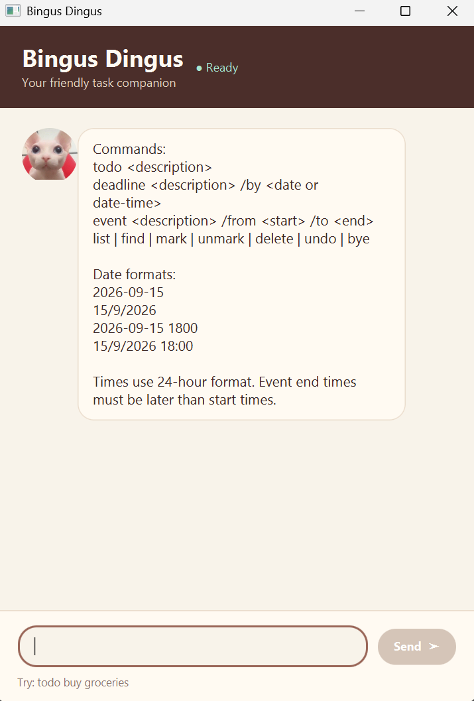

# Bingus Dingus User Guide

Bingus Dingus is a desktop task manager that helps you keep track of todos,
deadlines, and events. It uses simple commands in a chat-like interface, so you
can manage your tasks quickly from the command box.

## Quick start

1. Ensure that [JDK 25](https://www.oracle.com/java/technologies/downloads/)
   is installed.
2. Download the latest `bingusdingus.jar` file and place it in a folder of
   your choice. This folder will be the application's working folder.
3. Open a terminal in that folder and run the application:

   ```text
   java -jar bingusdingus.jar
   ```

4. A Bingus Dingus window should appear. The application displays the `help`
   message automatically when it starts.

   

5. Type a command in the command box and press Enter or click **Send**. For
   example, try:

   ```text
   todo buy groceries
   list
   mark 1
   ```

6. Refer to the [Features](#features) section for details about each command.

## Features

### Notes about command format

* Words in `UPPER_CASE` are placeholders that you replace with your own values.
  For example, in `todo DESCRIPTION`, replace `DESCRIPTION` with `buy groceries`.
* Command names must be entered in lowercase.
* Task indexes are positive whole numbers. The index is the number shown beside
  a task by the `list` command, starting from `1`.
* Enter one space between command parts. Leading spaces, trailing spaces,
  repeated spaces, and tab characters are not accepted.
* Task descriptions must not contain the pipe character (`|`).

### Viewing help: `help`

Displays the available commands and supported date formats. The help message is
also displayed automatically when the application starts.

Format: `help`

### Adding a todo task: `todo`

Adds a task without a deadline or scheduled time.

Format: `todo DESCRIPTION`

Example:

```text
todo buy groceries
```

### Adding a deadline: `deadline`

Adds a task with a due date or due date and time.

Format: `deadline DESCRIPTION /by DATE_OR_DATE_TIME`

For accepted date and time formats, see [Date and time formats](#date-and-time-formats).

Example:

```text
deadline submit report /by 2026-09-15
```

### Adding an event: `event`

Adds a task with a start and end date or date/time. The end must be later than
the start.

Format: `event DESCRIPTION /from START /to END`

For accepted date and time formats, see [Date and time formats](#date-and-time-formats).

Example:

```text
event team meeting /from 2026-09-15 1000 /to 2026-09-15 1100
```

### Listing tasks: `list`

Shows all tasks in their current order. Each task is shown with a one-based
index that you can use with `mark`, `unmark`, and `delete`.

Format: `list`

Example output:

```text
Here are the tasks in your list:
1. [T][ ] buy groceries
2. [D][ ] submit report (by: Sep 15 2026)
```

`[T]`, `[D]`, and `[E]` identify todo, deadline, and event tasks respectively.
`[ ]` means that a task is not done, while `[X]` means that it is done.

### Finding tasks: `find`

Finds tasks whose descriptions contain the specified keyword. The search is
case-insensitive, and the original task indexes are preserved in the results.

Format: `find KEYWORD`

Example:

```text
find report
```

### Marking a task as done: `mark`

Marks the specified task as done.

Format: `mark INDEX`

Example:

```text
mark 1
```

### Marking a task as not done: `unmark`

Marks the specified task as not done.

Format: `unmark INDEX`

Example:

```text
unmark 1
```

### Deleting a task: `delete`

Removes the specified task from the list.

Format: `delete INDEX`

Example:

```text
delete 1
```

### Undoing a change: `undo`

Reverses the most recent successful state-changing command. Bingus Dingus keeps
one undo action at a time. Adding a task, marking a task, unmarking a task, or
deleting a task replaces the previous undo action.

Format: `undo`

Example:

```text
todo buy milk
undo
```

## Date and time formats

Deadlines and event start/end values accept the following formats:

| Input | Example |
| --- | --- |
| Date with year-month-day | `2026-09-15` |
| Date with day/month/year | `15/9/2026` |
| Date and time without a colon | `2026-09-15 1800` |
| Date and time with a colon | `15/9/2026 18:00` |

Times use the 24-hour clock. For example, `1800` and `18:00` both mean 6:00
PM. Date-only values are displayed as `MMM dd yyyy`, such as `Sep 15 2026`.
Values with a time are displayed using a 12-hour clock, such as
`Sep 15 2026 6:00 PM`.

## Invalid commands

If a command is missing required information or contains an invalid value,
Bingus Dingus displays an error message and leaves your task list unchanged.

For example, a deadline must include both a description and a date:

```text
deadline submit report
deadline requires a description and a date
```

If a task index does not exist, Bingus Dingus displays:

```text
Sorry, that task number is invalid.
```

## Saving your tasks

Bingus Dingus saves the task list automatically after every successful change.
The data is stored in `data/bingusdingus.txt` relative to the application
folder. You do not need to save manually.

## Command summary

| Action | Format |
| --- | --- |
| View help | `help` |
| Add a todo | `todo DESCRIPTION` |
| Add a deadline | `deadline DESCRIPTION /by DATE_OR_DATE_TIME` |
| Add an event | `event DESCRIPTION /from START /to END` |
| List tasks | `list` |
| Find tasks | `find KEYWORD` |
| Mark a task as done | `mark INDEX` |
| Mark a task as not done | `unmark INDEX` |
| Delete a task | `delete INDEX` |
| Undo the latest change | `undo` |
